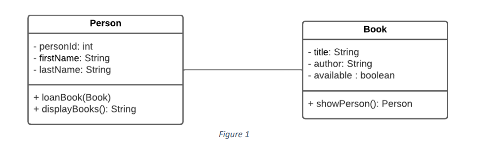

# OOP mini-project (Book Lender)

1. The simplified class diagram is part of a much larger program is shown in Figure 1 should be  
   implemented. It is part of a book lender system where a person loans a book or more.  
   In this program, each person needs to know all books that he or she has on landed, while each  
   book only needs to know which person is currently having the book.  
>- Provide an implementation of the diagram.
>- Create implementations for the methods shown in the diagram.
>- Add additional methods and/or attributes as you see fit with implementation.

### Draft Class Diagram

### Covering
- [x] Class diagram.
- [x] Relationship between Classes.
- [x] Encapsulation (Constructors, getters, and setters)
